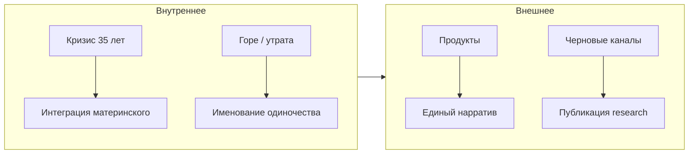

# Карта сознания

Интегральная схема (упрощённый AQAL) — четыре квадранта опыта Артура/Луна по текстам и проектам.

```
                    ИНДИВИДУАЛЬНОЕ          КОЛЛЕКТИВНОЕ
                 ┌────────────────────┬────────────────────┐
    ВНУТРЕННЕЕ   │  Я-внутри          │  Мы-внутри         │
    (субъективное)│  переживания, сны, │  культура, город,  │
                 │  тело, горе        │  эпохи, язык       │
                 ├────────────────────┼────────────────────┤
    ВНЕШНЕЕ      │  Я-снаружи         │  Оно-снаружи       │
    (объективное)│  тело, практика,   │  код, системы,     │
                 │  голос, ходьба     │  продукты, API      │
                 └────────────────────┴────────────────────┘
```

---

## Верхний левый: Я-внутри (субъективный опыт)

**Состояние:** богатый, хорошо текстурированный слой.

Ты умеешь различать оттенки:
- беспомощность *в конкретной плоскости* (отношения), не вообще;
- мать как внутренний объект, пробуждающийся в определённый момент;
- «путь, прокладываемый упавшими деревьями» — точная метафора движения через препятствие.

**Напряжение:** кризис февраля 2026 (35 лет, «расширение и смерть») в апреле описан как уже-пережитый, но лингвистически — как **ещё не интегрированный**. «Всё измеряется в масле» — блестящий финал, но не обязательно завершение.

**Теневая зона:** одиночество как неназванная тема. «Посвящаю / тебе, сердце моё» — обращение к себе. «Как ты сейчас?» — вопрос к читателю, легко читаемый как автопроекция.

---

## Верхний правый: Я-снаружи (поведение, тело)

**Состояние:** высокая соматическая осведомлённость.

Маркеры: «тяжело дышать этим летом», «связь с высшим = связь с низшим», козы/костёр/физический труд как якоря кризиса. Тело — живой свидетель, не метафора.

**Практики:** йога (эпоха «Делайогу»), дыхание, городские прогулки, голос, музыка «на коленке».

**Профессиональная инкорпорация:** соматическая психология не только тема канала — она **вшита в способ писать и думать**.

---

## Нижний левый: Мы-внутри (культура, смыслы)

**Состояние:** сильная городская и биографическая культура.

- Эпохи-адреса Екатеринбурга — коллективная память места.
- «Народная воля», «Рябиновое государство» — личное через историческое/мифологическое.
- Православный шествие по Ленина — культурный ритм города, не обязательно вера.

**Напряжение:** коллективное «мы» редко полноценный субъект в постах. Сообщество существует как **проект** (региональные музыканты, Cultura nova, коммунальная жизнь), но не как переживаемая близость в публичном тексте.

**Ресурс:** способность создавать **контейнеры смысла** — эпохи, каналы, теги — для себя и потенциально для других.

---

## Нижний правый: Оно-снаружи (системы, структуры)

**Состояние:** технические системы как материализованная философия.

| Продукт | Философия в коде |
|---------|------------------|
| OmPlayer | «просто побыть, пока песня длится» — антипотребительская модель |
| Sacred Geometry Lab | «математически точен, ничего не домысливает» — антипроекция |
| arturlun.ru | человеческо-техническая поддержка, форма заявки, админка |
| Хроника | биография как база данных, эпохи как индексы |

Код — высказывание о мире. Ты это понимаешь и делаешь сознательно.

---

## Линии развития по квадрантам



---

## Уровни глубины (спиральная метафора, не шкала)

| Уровень | Как проявляется | Каналы |
|---------|-----------------|--------|
| Повседневное | VK, короткие заметки, сезон | vk-wall, instagram |
| Телесное | Да и Да, практика, дыхание | da-i-da |
| Исследовательское | «исследование и есть терапия» | research (draft) |
| Символическое | таро, сны, магия | omnes colores (draft) |
| Культурное | мышление, рефлексия | cultura-nova (draft) |
| Системное | код, архитектура, API | лендинг, кейсы |

Ты **одновременно** на нескольких уровнях — не «выше/ниже», а разные грани одного процесса.

---

## Центральный узел карты

**Пересечение тела, города и языка.**

- Тело — где чувствуешь.
- Город — где живёшь и именуешь время.
- Язык — как связываешь внутреннее с внешним.

Код и музыка — **два способа воплотить** это пересечение в артефакты.

---

## Вопросы для самопроверки

1. Где в карте «дыра» — квадрант, который богат в жизни, но беден в тексте?
2. Что изменится, если «мы-внутри» станет не проектом, а переживанием в посте?
3. Какой квадрант ты защищаешь антискриптовой позицией?
