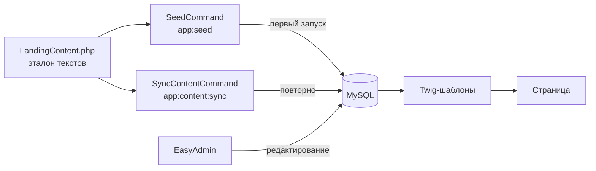

# Контент и seed

## Схема: от кода до страницы



**На сайте всегда показывается то, что в базе.**  
PHP-файл `LandingContent.php` — это «исходник по умолчанию», который команды кладут в БД.

---

## Где что лежит

### 1. Эталон текстов лендинга (главный источник для seed/sync)

**Файл:** `src/Content/LandingContent.php`

| Метод / массив | Назначение |
|----------------|------------|
| `heroLead()` | Основной текст в hero («Занимаюсь разработкой…») |
| `metaTagline()` | Meta description, поле «Краткое описание» в настройках |
| `blocks()` | Все секции лендинга: slug, тип, title, subtitle, body, items |

Каждый элемент `blocks()` попадает в таблицу `content_block` с полем `slug` как ключом.

### 2. Настройки сайта (не блоки)

**Seed:** `src/Command/SeedCommand.php` → метод `seedSettings()`

Создаётся **один раз**, если таблица `site_settings` пуста:

| Поле | Откуда значение |
|------|-----------------|
| `name` | `'Артур'` (зашито в SeedCommand) |
| `tagline` | `LandingContent::metaTagline()` |
| `city` | `'Екатеринбург'` |
| `formSuccessMessage` | `'Благодарю за Ваш запрос! Скоро вернусь с обратной связью'` |

Остальное (аватар, Telegram, GitHub, email) — только через **админку → Настройки сайта**.

`app:content:sync` **перезаписывает только `tagline`** из `metaTagline()`. Имя, город и сообщение формы sync не трогает.

### 3. Администратор

**Seed:** `src/Command/SeedCommand.php` → `seedAdmin()`

| Поле | Откуда |
|------|--------|
| email | `ADMIN_EMAIL` из `.env` |
| password | `ADMIN_PASSWORD` из `.env` |

Создаётся **один раз**, если в `admin_user` никого нет.

### 4. Что НЕ в seed / LandingContent

Эти сущности живут только в БД и редактируются в админке:

| Сущность | Таблица | Раздел админки |
|----------|---------|----------------|
| Заявки | `inquiry` | Заявки |
| Кейсы | `case_study` | Кейсы |
| Ссылки на оплату | `payment_offer` | Оплата |

Подписи типов заявки в форме — **не контент**, а enum: `src/Enum/InquiryType.php`.

### 5. Вёрстка и стили (не в БД)

| Что | Где |
|-----|-----|
| Разметка секций | `templates/web/home/index.html.twig` |
| Шапка, футер, meta | `templates/web/layout.html.twig` |
| Карточки | `templates/web/_partials/content_card.html.twig` |
| Стили | `public/css/site.css` |
| JS (форма, файлы) | `public/js/site.js` |

Slug блока должен совпадать с тем, что ожидает шаблон (см. таблицу ниже).

---

## Команды

### `app:seed` — первичное наполнение

```
php bin/console app:seed
```

| Шаг | Поведение |
|-----|-----------|
| Настройки сайта | Создать, **если таблица пуста** |
| Блоки контента | Upsert по `slug` из `LandingContent::blocks()` |
| Админ | Создать, **если админов нет** |

Безопасно запускать повторно: существующие настройки и админ не перезапишутся, блоки обновятся.

### `app:content:sync` — обновить тексты из кода

```
php bin/console app:content:sync
```

- Перезаписывает **все поля** каждого блока из `LandingContent::blocks()`.
- Ставит `isVisible = true`.
- Обновляет `tagline` в настройках из `metaTagline()`.

⚠️ Правки в админке, сделанные после sync, будут потеряны при следующем sync.

---

## Таблица блоков (slug → страница)

| slug | Секция на сайте | Шаблон | Поля |
|------|-----------------|--------|------|
| `hero` | Hero | `index.html.twig` | `title`, `subtitle`, `body` |
| `audience` | «Для кого» | `index.html.twig` | `title`, `body` |
| `pains` | «Возможно, вам ко мне…» | `index.html.twig` | `title`, `subtitle`, `items[].text` |
| `specialization` | «На чём я специализируюсь» | `index.html.twig` | `title`, `body` (2 абзаца через `\n\n`) |
| `services` | «Что это может быть» | `index.html.twig` | `title`, `items[].title`, `items[].text` |
| `philosophy` | «Своё решение» | `index.html.twig` | `title`, `body` |
| `process` | «Что я предлагаю» | `index.html.twig` | `title`, `items[].title`, `items[].text` |
| `work_formats` | «Формы взаимодействия» | `index.html.twig` | `title`, `items[].title`, `items[].text` |
| `form_intro` | Заголовок формы | `index.html.twig` | `title`, `subtitle`, `body` |
| `footer_legal` | Футер «Как работаю» | `layout.html.twig` | `title`, `body` |
| `footer_excludes` | Футер «Что не предлагаю» | `layout.html.twig` | `title`, `items[].text` |

Тип блока (`ContentBlockType`) нужен для админки и подсказок; на фронте секция определяется **slug + шаблон**.

---

## Как сайт читает контент

1. `LandingContentProvider` (`src/Service/LandingContentProvider.php`) — блоки из БД по `sortOrder`.
2. `HomeController` передаёт в шаблон `blocksBySlug` (ассоциативный массив по slug).
3. `TwigGlobalSubscriber` добавляет глобально `settings` и footer-блоки (`footer_*`) для `layout.html.twig`.

---

## Типичные сценарии

### Изменил текст в коде перед деплоем

1. Правка `src/Content/LandingContent.php`
2. Деплой
3. `php bin/console app:content:sync` на сервере

### Правка без деплоя (контент-менеджер)

Админка → **Блоки контента** или **Настройки сайта**.  
Sync потом не запускать, если не хотите затереть правки.

### Новая секция на лендинге

1. Добавить блок в `LandingContent::blocks()` с новым `slug`
2. Добавить секцию в `templates/web/home/index.html.twig`
3. `app:content:sync` или `app:seed`
4. При необходимости — стили в `public/css/site.css`

### Свежая база с нуля

```bash
docker compose exec php php bin/console doctrine:migrations:migrate --no-interaction
docker compose exec php php bin/console app:seed
```

---

## Связанные файлы (шпаргалка)

```
src/Content/LandingContent.php      ← эталон всех текстов блоков
src/Command/SeedCommand.php         ← app:seed
src/Command/SyncContentCommand.php  ← app:content:sync
src/Entity/ContentBlock.php         ← модель блока
src/Entity/SiteSettings.php         ← имя, tagline, аватар, ссылки
src/Service/LandingContentProvider.php
src/Admin/ContentBlockCrudController.php
src/Admin/SiteSettingsCrudController.php
templates/web/home/index.html.twig
templates/web/layout.html.twig
```
